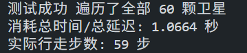
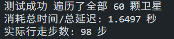

# 监督学习
## 1. 专家数据

* **专家的逻辑**：在每一次面临路由选择时，程序会计算当前卫星到所有未访问卫星的最短物理延迟路径（基于 Dijkstra 算法），然后选出距离最近的那颗卫星，并输出前往该目标的第一跳动作
* **数据的内容**：每一条训练样本都是一个严格的[状态 (State) -> 动作 (Action)]对
    * 如果数据包成功走完了全部卫星，整个回合的轨迹就会被保存

---

## 2. 输入特征

### A. 邻接矩阵
一个 $[N, N]$ 的二进制矩阵（0 或 1），表示此时此刻哪两颗卫星之间有物理链路连接

### B. 节点特征 
一个 $[N, 5]$ 的矩阵

1.  **轨面比例**：这颗卫星在哪一个轨道面上
2.  **轨内索引比例**：这颗卫星在当前轨道面排第几
3.  **是否已访问**：去过的不能再去（防止死循环）
4.  **是否为当前节点**
5.  **一跳归一化延迟 (0.0 ~ 1.0)**：表示从当前节点跳到该候选节点需要多久，如果不相连或本身就是当前节点，设为 0

---

## 3. 网络架构

### GNN 图编码器
* 这里堆叠了 3 层稠密图卷积 (`DenseGCNLayer`)
* 它的作用是**消息传递**，经过 3 层网络，每颗卫星不仅保留了自己原本的 5 维特征，还吸收了它周围 3 跳以内所有邻居的状态信息
* 最终，每颗卫星都会被编码成一个包含丰富上下文的 64 维高级特征向量

### MLP 动作打分机制
* 网络会把 **当前所在卫星** 的 64 维特征提取出来，然后分别跟 **全网每一颗卫星** 的 64 维特征拼接在一起，变成一个 128 维的向量
* 把这个 128 维向量送进 MLP，输出一个预测分数
* 动作掩码：算出所有节点的分数后，网络会利用邻接矩阵，强制把那些**没有链路相连**的卫星的分数改成极小值 (`-1e9`)

---

## 4. 训练输出与迭代法则

* **模型输出**：一个长度为 $N$ (卫星总数) 的向量，代表跳向每一颗卫星的概率倾向
* **目标标签**：Dijkstra 在同样局势下选择的那颗卫星的 ID
* **损失函数**：`CrossEntropyLoss`
* **反向传播**：更新参数

## 5. 测试效果

利用训练完成的模型权重 (`sl_policy.pth`) 在包含 60 颗卫星的仿真环境中进行推理测试，结果展现了明显的优势与局限性

### 1. 理想环境测试 
* **表现**：仅耗时 1.06 秒，实际行走 **59 步** 完美遍历全部 60 颗卫星
* **结论**：模型成功内化了 Dijkstra 算法的寻路逻辑

### 2. 残缺环境测试
* **表现**：耗时 1.64 秒，实际行走 **98 步** 完成遍历
* **结论**
    * **合法动作掩码的有效性**：在面临 10% 随机断链下，掩码机制成功拦截了网络通往断链的错误动作，逼迫模型选择次优合法路径，保障了系统存活并最终完成任务
    * **纯策略网络的局限性**：测试日志暴露出大量的原地反复横跳。这表明仅经过监督学习的 Actor 网络是短视的，缺乏对全局延迟代价的评估能力，在遇到局部死路时易陷入局部最优
    

