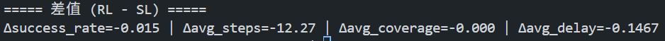
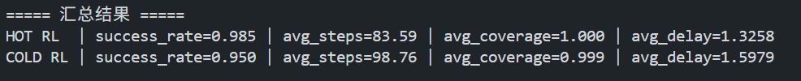

# 强化学习

---

## 1. 强化环境 

### 终止条件
1. **死胡同：** 走到一颗卫星，发现它没有任何合法的邻居链路，失败结束
2. **非法动作：** 企图跳向当前不相连的卫星，失败结束
3. **超时：** 步数超过 `总卫星数 × 3`，防止无限循环
4. **成功：** 成功遍历所有的卫星。

### 奖励函数
* **延迟惩罚：** `Reward = -1.0 × 物理延迟`。每走一步都要扣分，走得越慢扣得越多，逼迫寻找最短路径
* **探索奖励：** 只要走到一颗以前没去过的新卫星，额外奖励 `+0.2`；如果走回头路，轻微惩罚 `-0.1`
* **失败重罚：** 如果违规、走入死胡同或超时，给予巨额惩罚 `-5.0`
* **成功奖励：** 如果成功走完全程，给予巨额奖励 `+10.0`

---

## 2. 网络架构

在强化学习阶段，网络升级为 Actor-Critic 架构。底层首先通过共享的 GNN 编码器（3 层 DenseGCN）将原始的 5 维节点特征转化为富含拓扑信息的 64 维节点高级特征，随后分流给 Actor 和 Critic 两个决策头

### A. Actor
* **继承与热启动：** 此部分结构与 SL 阶段的 `PolicyNet` 完全一致，代码通过 `load_pretrained_policy` 直接读取 SL 阶段训练好的权重
* **输入特征：** GNN 输出的 `node_embeddings`。提取**当前所在卫星**的 64 维特征，将其复制 $N$ 份后，与**全网 $N$ 颗卫星**的 64 维特征进行一对一拼接，形成形状为 `[Batch, N, 128]` 的成对关系特征
* **网络架构：** 经过一个多层感知机 `score_mlp`为每个节点打分，随后强制应用**拓扑动作掩码 (Action Masking)**，将不相连卫星的分数替换为极小值（-1e9）
* **输出特征：** `masked_logits`，形状为 `[Batch, N]`，代表跳向每颗卫星的概率得分，从物理边界上彻底屏蔽了非法动作

### B. Critic
* **特征融合（输入特征）：** 为了精准评估局势好坏，Critic 并没有简单地对所有节点求和，而是巧妙融合了三种不同维度的 64 维图特征：
  1. `h_curr`：**当前所在卫星的特征**
  2. `h_global`：**全图所有卫星的平均特征**
  3. `h_unvisited`：**未访问卫星的平均特征**
* **网络架构：** 将上述三个特征拼接在一起，形成一个丰富的 `[Batch, 192]` 维全局状态表示，随后送入全新的多层感知机 `value_mlp`（结构为 `Linear(192, 64) -> ReLU -> Linear(64, 1)`）
* **输出特征：** 一个标量数值 $V(s)$，形状为 `[Batch, 1]`。代表当前状态的状态价值，用于预测从此刻开始直到回合结束，预期还能拿到的总回报

---

## 3. 训练引擎：PPO 

### 第一步：收集经验 
把走过的每一步记录在 `RolloutBuffer` 里：
包含 `(图状态, 动作, 专家给出该动作的概率, 获得的奖励, 是否结束, Critic对当前局势的打分)`

### 第二步：计算优势 
* 如果某一步走完后，最终得到的总回报**高于** Critic 事前的预期打分 $V(s)$，Advantage 为正
* 如果最终回报**低于**预期，Advantage 为负

### 第三步：策略更新与裁剪 (PPO Clip)
* **Actor 更新：** 增加优势为正的触发概率，降低优势为负的触发概率
* **PPO 裁剪保护：** 为了防止一下子步子迈得太大，PPO 限制了每次更新的幅度（`eps_clip=0.2`），保证学习过程平稳
* **Critic 更新：** 让 Critic 的打分越来越接近真实的最终回报（MSE Loss）

---

## 4. 评测

* **控制变量法：** 统一的环境配置，固定的随机种子序列。保证 SL 模型和 RL 模型面临的断链情况、卫星初始位置**完全一模一样**。
* **数据对比：**
    * 延迟大幅缩减 (Δavg_delay = -0.1467s)： RL 模型将平均总延迟降低了近 150 毫秒
    * 无效跳数锐减 (Δavg_steps = -12.27步)： RL 平均每局比 SL 少走 12 步以上，数据包在网络中无意义的盲目绕路大幅减少

